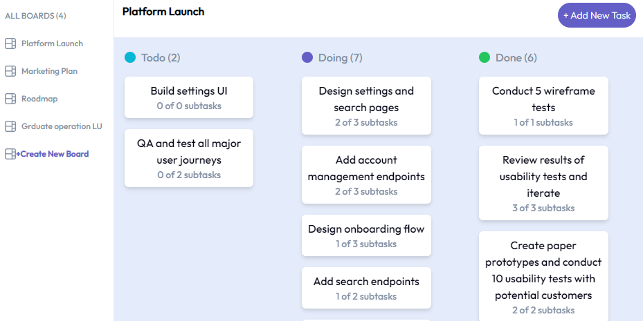

# Kanban Board

## Table of contents

- [Overview](#overview)
  - [The challenge](#the-challenge)
  - [Screenshot](#screenshot)
  - [Links](#links)
- [My process](#my-process)
  - [Built with](#built-with)
  - [What I learned](#what-i-learned)
  - [Continued development](#continued-development)

## Overview

### The challenge

Users should be able to:

- View all available boards on page load
- Each board should contain tasks categorized into their completion status
- Each task may contain subtasks
- Create, Read, Update, Delete all boards, tasks, and subtasks

### Screenshot

### Links

- Live URL: Coming Soon

## My process

### Built with

- [React](https://reactjs.org/) - JS library
- [Tailwind](https://tailwindcss.com/) - JS library
- [Express](https://expressjs.com/) - Node library
- [PostgreSQL](https://www.postgresql.org/) - Database

### What I learned

This is my first fullstack app that utilized React. My aim was to create an application that allowed full CRUD to a live database. I wanted to build an application that had nested components to practive using props and state that was shared throughout the application. The more difficult area to work with was the database because of how the data needed to be set up (primary keys and foreign keys) in order to keep all relevant boards tasks and subtasks related to eachother.

### Continued development

I would mostly like to imporve the UX and Ui, making the buttons and popup boxes more responsive and user friendly. I would also like to implement the useContext hook to handle a dark mode.
